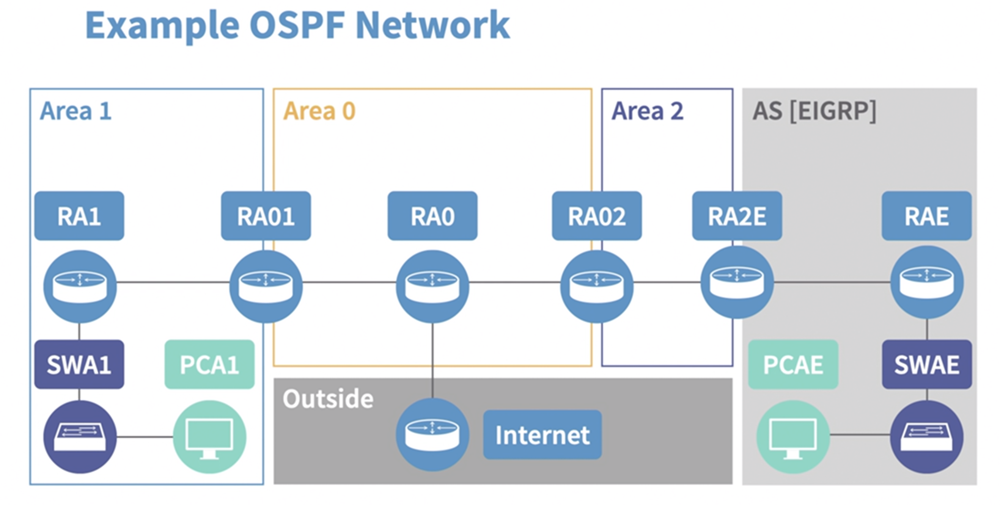
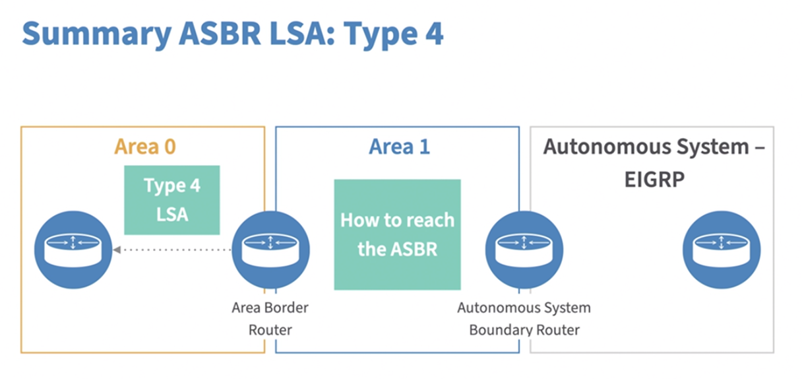
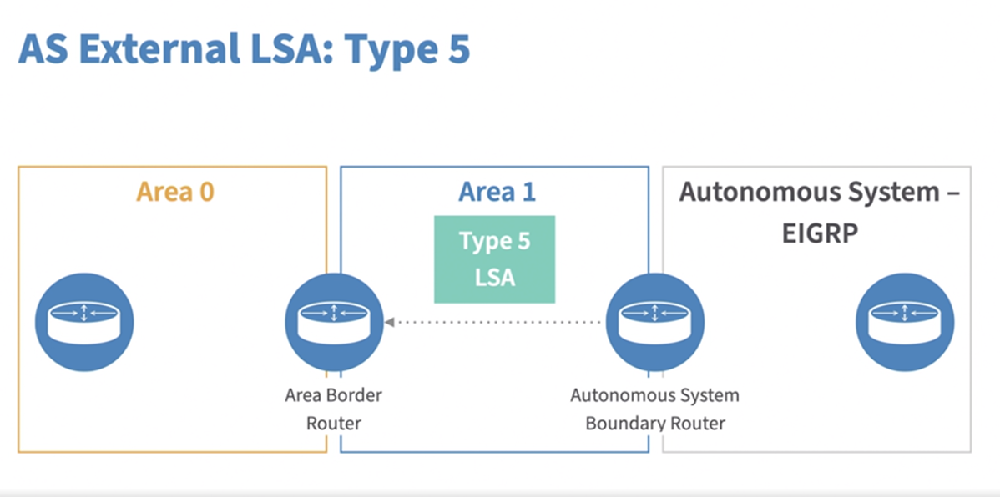
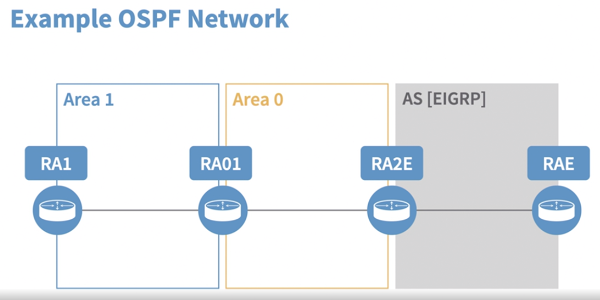
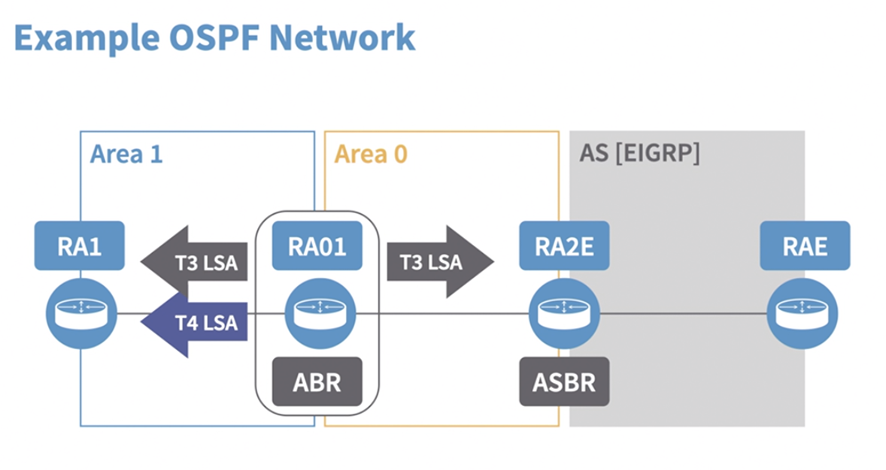
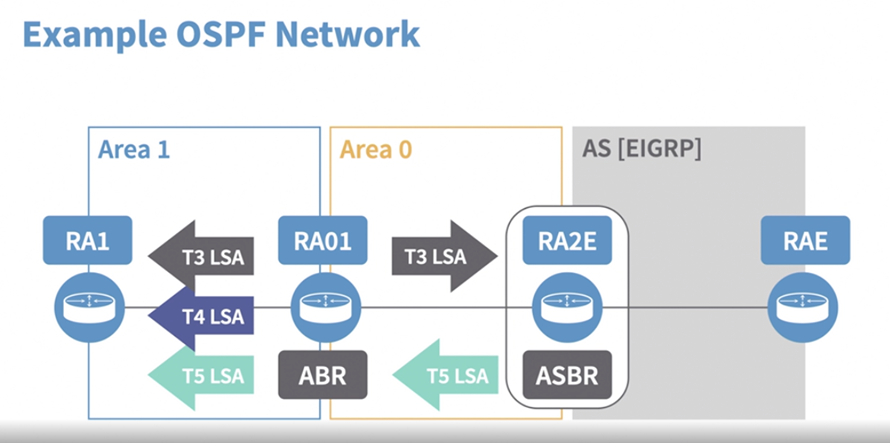
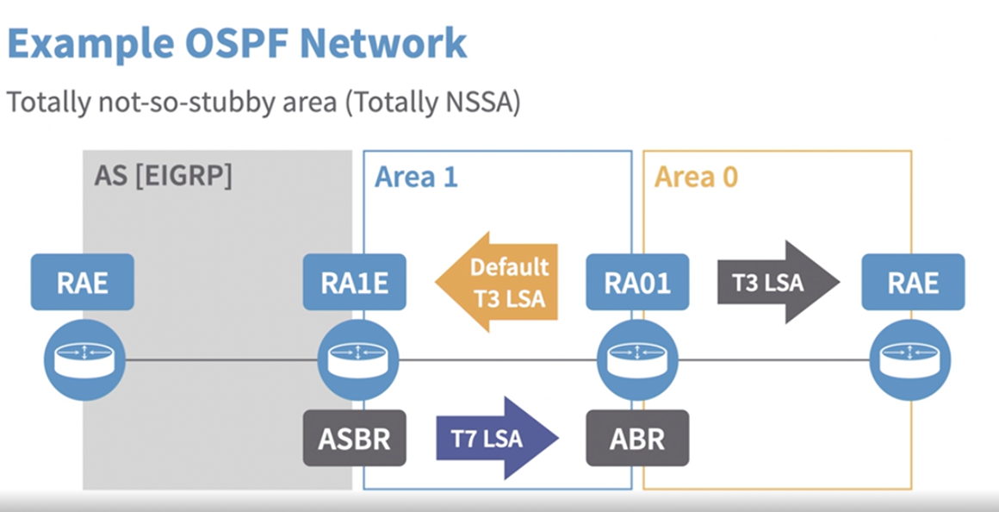
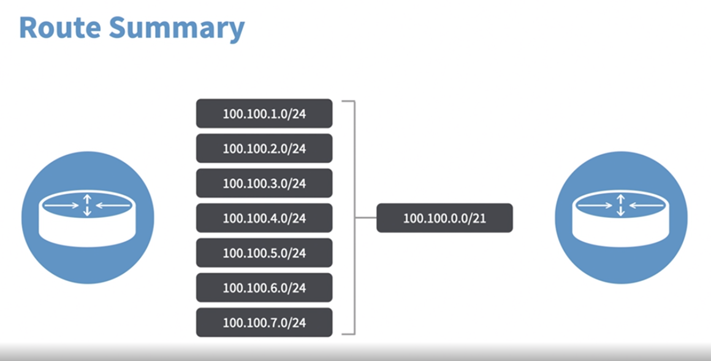
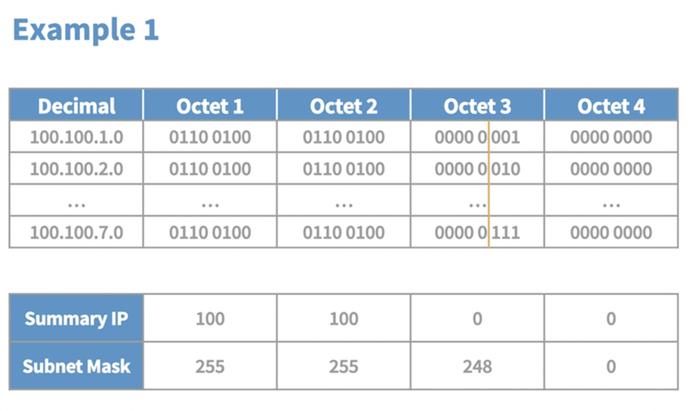
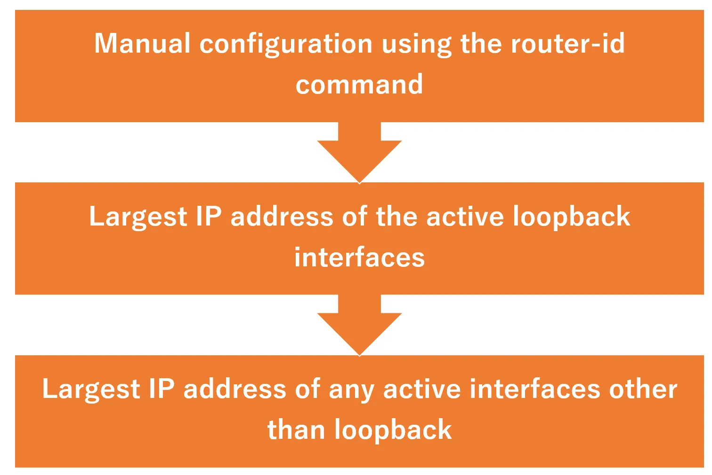

# OSPF - Open Shortest Path First

OSPF - link state routing protocol. This means that it sends out the routing tables through link state info (LSAs).  

LSDB = Linkstate database = Topology map for the topology  
LSA = information, however the actual packet data is the LSU
LSU = Link State Update  
LSR = Link State Request = request for route information from info - neighbour responds with LSU - acknowledges with LSack  

Path selection for OSPF uses the Shortest Path First algo (Dijkstra's algo)  
Link state information is flooded through the network allowing the network ospf routers to be in sync.  

## OSPF Areas

A network where routers all have the same routing information = OSPF area - i.e. network updates are localised and router share topology information.

Big networks are split up into different 'areas' to make things more manageable and reduce network traffic  

Area 0 is the backbone - all other areas need to be connected to area 0 resulting in a **heirarchical design**  

Size? How many routers in each area? The old recommendation was if you get to 50, break the area up.  

## OSPF Parameters

OSPF routers send 'hello' packets to eachother, like good neighbours ought to. This:
* confirms that they are neighbours
* confirms they are reachable
* info that results in an evaluation of whether or not the neighbour relationship should be built on (no house warming gifts though)

To meet neighbour requirements and join the club:
* must be in the same area (ok doh)
* identical fields
  * hello timer (you wouldn't want your neighbour saying hello to you at 1 am)
  * dead timer (who wants to die before their neighbour)
  * authentication (vet your neighbour, don't give em the house keys unless they're trustworthy)
  * maximum transmission unit
  * stub flags

### Hello Timer

> Interval in seconds at which a router sends hello message out of an OSPF interface.  

By default 10 seconds on broadcast/p2p, 30 seconds on non broadcast multi access networks

### Dead Timer

> Time in seconds an OSPF will wait to receive a hello message before deciding the neighbour is down  

4x hello timer by default  

##### In exec mode `show ip space ospf interface`

### Wait Timer

> Number of seconds a router waits for a designated router before beginning an 'election'  

(Info on designated routers coming up)

### Retransmit time

> Number of seconds a router waits before retransmitting an OSPF packet that hasn't been acknowledged

### Change Timers

In interface config `ip ospf ?`  

Example:  
`ip ospf hello-interval ?` to see accepted values

### Back to the neighbours

Other things that need to match as mentioned above (no, above that, nah nah, more, yeahh)  
* Authentication - if it enabled
* MTU (no explanation provided :thonk:)  
* Stub flags (^^)  

When sending hello packets to all other routers -> multicast address `224.0.0.5` or `FF02::5` (IPv6)

## OSPF DR/BDR election (be responsible, never skip elections, your vote counts {and some such words})

So just because these routers have established they are neighbours, doesn't mean they're all gonna be close with eachother (Gina Gateway across the street's parties are too loud, Mary Modem next door plays violin at 3 am and Robert Router smokes 10 times a day)  

> Router adjacencies (neighbour best buddies): neighbour routers that share LSUs (Link State Update - topology info update) and database description packates  

*Think of it like having daily LSU parties where you gossip with your router adjacencies about the latest routers and topology changes*  

### OSPF Adjacencies Formula (the formula for best neighbours)

**[n*(n-1)]/2**
n = number of routers

`4 routers = 6 adjacencies`  
`10 routers = 45 adjacencies`  

To reduce the number of adjacencies, ospf routers elect a designated router (DR) and a backup designated router (BDR)  
So routers in a network only need to form adjacencies with the DR OR the BDR. Less ~~neighbours~~ adjacencies less headaches right?

`show ip ospf neighbour` - shows neighbours (not adjacencies tho)  

### BR/DBR Election

Factors:
1. Priority level (default is 1) - `sh ip ospf priority <#>` to set a router's priority
  * Candidacy destroyer - set priority level to 0 if you don't want the router to join the election
2. Router ID - `router ospf 1` `router-id <id>`
  * Router ID is in IP address format
  * the router will apply the highest interface IP adderss as it's router ID
3. Loopback interface IP address - highest loopback address wins
4. Interface IP address - `sh ip ospf topology-info` - `show ip int br`
  * the router will apply the highest interface IP adderss as it's router ID

## OSPF Network Types

Since OSPF is so widely used it supports many different types of networks.  

**Point to Point**  
Link between only two points i.e. two router connecting to eachother  
Default ospf network type on a non ospf network type on a non frame relay serial interface  
No need for elections as the neighbourhood is too small for a president xD (since there are only two routers and two candidate for DR and DBR)

**Broadcast Network**  
Default ospf network type for ethernet interfaces.  
Broadcast message received by the entire subnet, thus DR and DBR are required.  

**Non broadcast multiple access**  
Default on a physical Frame Relay serial interface  
Hello packets are transmitted as unicast packets to each of their adjacent neighbours  
There is DR/BDR election  
You need to explicitly specify the neighbour's IP address in this network  

**Point to Multipoint**  
The permanent virtual circuits are organised into a collection of point-to-point-networks  
No DR/DBR election in a point-to-multipoint network type  

  

## ABR vs ASBR Routers

ABR = area border router - more processing power to support multiple areas and routing tables - handle info for two different areas  
ASBR = autonmous system boundary router - used to connect an ospf network to a non-ospf network  

ABR's and ASBR's are like bridges between two networks. Instead of sending full route information, they send summarised information to other areas, this is called router summarisation.  
ABR's and ASBR's are not configured to be so, they automatically become so when placed between areas.

## LSA Types

The LSA (link-state advertisement) has a number of types:
* Router/Type 1 LSA - created by each router, used to advertise directly attached networks
* Network/Type 2 LSA - created in transit networks for DR and BDR elections - is not used in networks with no elections
* Summary/Type 3 LSA - created by Area Border Routers (ABRs) to advertise networks/areas to eachother
* Type 4 is the 'Summary ASBR LSA' - created by an Area Border Router (ABR) to tell an area how to reach an ASBR (Autonomous System Boundary Router)
  
* Type 5 is the 'Autonomous System (AS) External LSA' - created by an ASBR to advertise networks to advertise networks that are not ospf (autonomous system) 

To check, in exec mode `sh ip ospf database` - shows the various LSA's  

## Stub Areas

  

In the below topology, the ABR sends Type 3 LSA's (to advertise area 1 and 0 to eachother) as well as the Type 4 LSA (to tell area 1 how to reach the EIGRP network)  

  

The ASBR also sends Type 5 LSA's (to advertise itself to area's 0 and 1) which are also passed on by the ABR  

  

Now in this secenario, if area 1 needs to reach the EIGRP network, all that is actually required is to route to the ABR, which can then handle routing to the EIGRP network... This will make the routing more efficient as not as many LSA's are needed. In this scenario, the ABR can just send a type 3 LSA (advertising the areas to eachother). This is known as a **stub area**.  

A stub area is only directly connected to area 0 (through the ABR advertising) and is not directly connected to any autonomous systems (which the ABR handles). This scenario looks like this:  

  

Now in this case, since area 1 is not connected to anything other than area 0, meaning outside network communication is only through the ABR, we will only need the default route instead. This type of area is called a **Totally Stubby Area (TSA)** [ok, I'm confused too but I promise I'm not trolling, the teacher though... idk :thonk]  

HOWEVER, if the autonomous system is connected directoy to the stub area - it becomes a **Not-so-stubby area (NSSA)**. (ok at this point - teacher is defintely trolling :sob:)  

HOWEVER, there is a rule saying that type 5 LSA's (made by the ASBR to advertise an autonomous system) CANNOT be sent to a stub area (da heck is going???). So an ASBR advertising the autonomous system to an area is now called a **T7 LSA**... bruh.....   

  

Now in this scenario we are seing individual type 3 LSA's again, which can be replaced by default type 3 LSA's. If we do this, the area then becomes a **Totally not-so-stubby area (Totally NSSA)**  

  

If at this point you are not so confused you are question your life, existence and the universe, please considering donating IQ points to this brain, your supoort is appreciated  

Type 6 LSAs were defined for Multicast Extensions to OSPF (MOSPF) - deprecated since ospf v3.  

## Making sense of all this weird stuff

  

In the first, stub area diagram, we see that the ABR is sending two types of Type 3 LSA's.... One is the 'individual t3 LSA' this is the LSA that is advertising Area 0. The second one is the 'Default T3 LSA' which is coming through the ABR from the ASBR and contains information on reaching the EIGRP network *indirectly* by routing through the ABR.   

Now at this point, if we want to cut down even more, we can make the ABR our default route anyway, and cut out the both type 3 LSAs replacing them with a default route to the ABR. Now this is called a 'Totally Stubby Area', which kinda makes sense right? So now instead of 2 Type 3 LSAs we only need on, leading to the ABR and Area 0.  

Now, if an autonomous system (non ospf system) is connected to a stub area (DIRECTLY), this is called a Not so stubby area. HOWEVER, if we want to get rid of the type 3 LSAs (and replace with a default route) here, we can... and then the area is called a TOTALLY not so stubby area.  

  

Using an external source because I just love stubs, this is what it's free version has to say:  

Once a stub area is configured:
* No LSA Type 5 (external routes to non ospf networks) - so the ABR will block this LSA
* No ASBR in the area (if there is then it will become a not so stubby area with a type 7 LSA)

Once a totally stubby area is configured:
* No LSA Type 5 (external routes)
* No type 3 LSA
* No ASBR

Not so stubby area:
* No LSA Type 5
* ASBR Allowed

Totally not so stubby area:
* No LSA Type 5
* No LSA Type 3
* No ASBR

Now that's out of the way.... moving on... :sweat_smile: 

## Router summarisation (supernetting)

> A route summary is a consolidation of multiple routes into a single route advertisement  

  

Reduces route table entries - saves cpu resources - can only summarise if the networks are similarly addressed. Each binary digit is moved down if all are the same, if they aren't the supernet address stops there. Naturally the subnet mask needs to reflect the supernet address.

## OSPF Tables

Routers within the same area all have the same topology map. If a router goes down, then the other routers can immediately figure out alternate paths and change the routing tables.  

While all routers have the same *topology table*, each routers has *it's own** *routing table*  

Google maps example: everyone in the same suburb will have the same map of the area (topology table). However, each person will take different pathways to get to different destinations on the map, depending on our own location (routing table).  

In priveleged exec `sh ip ospf topology-info` and `ip ospf neighbour` `sh ip ospf database` `sh ip route ospf`  

## Commands and configuration information

In global config `router ospf [process id]` - process id is only local to the router and doesn't have to match the process id on the other routers  
More about process ids: 32 bit total, 8 bits seperated by dots (basically an ipv4 format), the id is kinda like the name of the router, a unique id is required for each router.  
Image from , this depicts how theh router ID is determined, so if manual configuration isn't done, then the largest ip address of the loopback interfaces will be used, etc.

In router config `network [ip address] [wildcard mask] area [area-id] - wildcard mask is an inverted subnet mask, `255.255.255.255 - subnet mask`  

